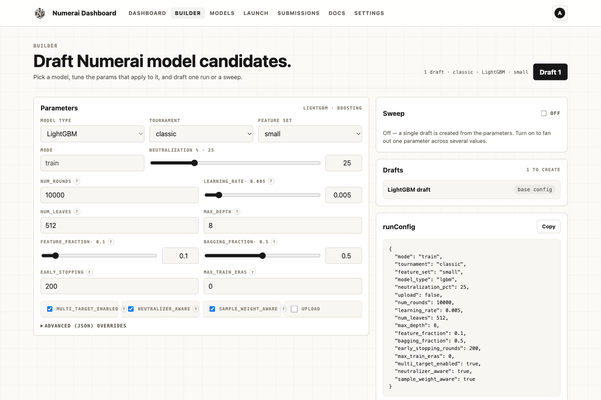
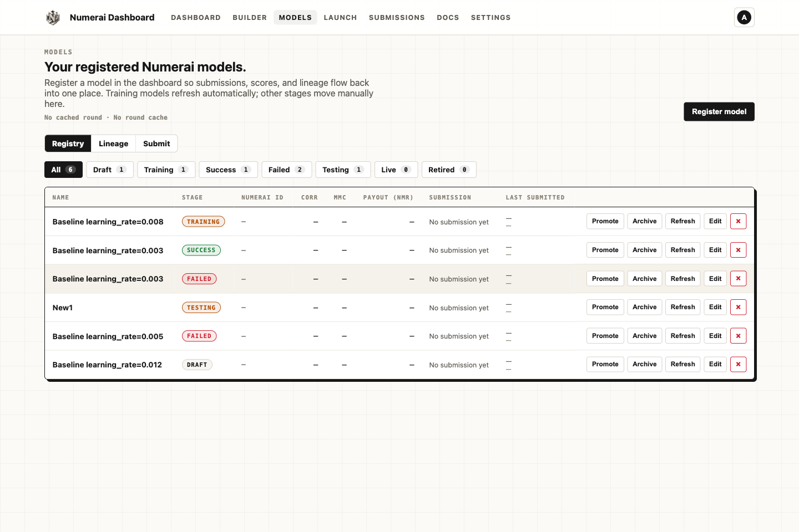
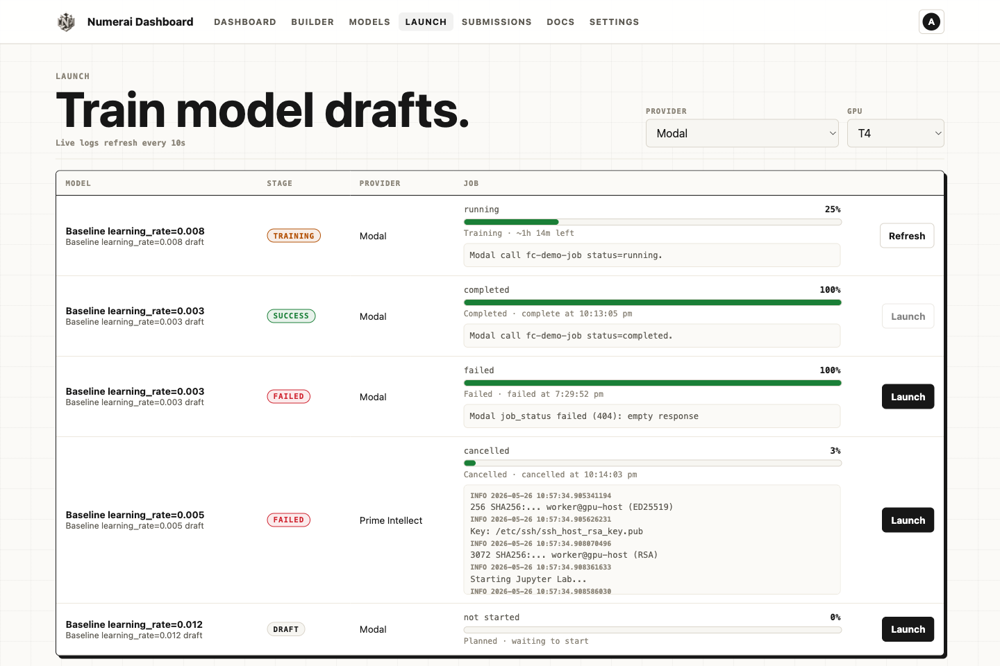
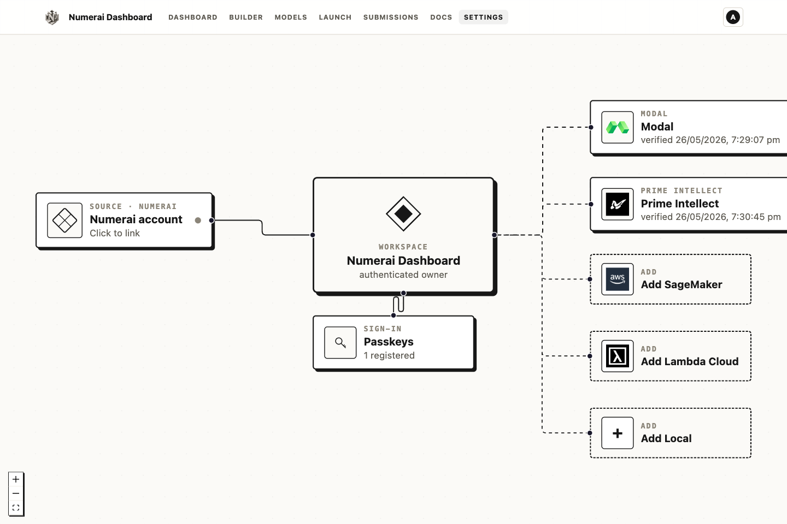
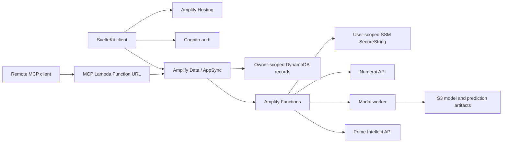

<p align="center">
  <a href="https://numeraidashboard.com">
    
  </a>
</p>

<h1 align="center">Numerai Dashboard</h1>

<p align="center">
  Open-source dashboard and ML toolkit for building, training, tracking, and submitting Numerai models.
</p>

<p align="center">
  <a href="https://numeraidashboard.com">Live app</a> |
  <a href="#quick-start">Quick start</a> |
  <a href="#integration-status">Integration status</a> |
  <a href="#license">License</a>
</p>

> [!IMPORTANT]
> **Project status: alpha.** Authentication, owner-scoped workspaces, model management,
> Modal workflows, Prime Intellect pod workflows, and live Numerai account/submission reads
> are implemented. Some provider actions and round metrics are still contract or prototype
> paths. Review [Integration status](#integration-status) before using real credentials or
> paying for compute.

Numerai model operations span datasets, feature pipelines, experiments, compute providers,
artifacts, model lineage, and tournament submissions. Numerai Dashboard brings those parts
into one workspace while keeping the executable ML workload available as regular Python.

## Screenshots

### Build model candidates

[](https://numeraidashboard.com/builder)

### Operate the model registry

[](https://numeraidashboard.com/models)

### Monitor training runs

[](https://numeraidashboard.com/launch)

### Connect the workspace

[](https://numeraidashboard.com/settings)

## Capabilities

- Build and persist model pipelines, branches, sweep plans, and training runs.
- Connect Numerai and compute-provider accounts without storing plaintext secrets in data rows.
- Launch, poll, and cancel supported cloud jobs through Amplify Functions.
- Track compute jobs, model registry entries, lineage, and submission history.
- Read live Numerai account and per-round submission data.
- Run the Python workload independently with LightGBM, XGBoost, CatBoost, neural models, TabPFN, or TabICL.
- Deploy the control plane with AWS Amplify Gen 2, Cognito, AppSync, Lambda, DynamoDB, and SSM.
- Control owned training runs remotely through an OAuth- or API-key-authenticated, stateless MCP endpoint.

## Integration Status

| Area | Status | Current boundary |
| --- | --- | --- |
| Authentication and workspace data | Working | Cognito email/passkey auth and owner-scoped Amplify Data models. |
| Credential storage | Working | User credentials are stored as SSM SecureString parameters; data rows contain only owner-scoped references. |
| Modal | API-backed | Training launch, status, cancellation, and inference/submission paths call Modal endpoints. Token verification is currently format-based. |
| Prime Intellect | API-backed | Live offer selection, managed/custom worker templates, pod launch, log polling, runtime limits, and automatic teardown call the provider API. |
| Numerai | Partial | Live account verification and submission-history reads are implemented. Automated score reconciliation and non-Modal upload workers remain incomplete. |
| SageMaker, local, and custom providers | Contract only | Provider records and deterministic queue transitions exist; Amplify does not yet launch real workers for these providers. |
| Round metrics | Prototype | `refreshRoundMetrics` currently produces deterministic placeholder snapshots, not live tournament scores. |

## Architecture



Sensitive function entry points bind the request to the authenticated Cognito subject.
Secret references must remain under that user's SSM namespace, and outbound provider URLs
are validated before credentials are resolved.

## Remote MCP Access

The dashboard exposes a hosted MCP server so agents can manage training runs and
submissions remotely:

```
https://lacdatamelsv55cio7jpnn5jxe0yvuvm.lambda-url.ap-southeast-2.on.aws/
```

Tools: `create_model`, `list_models`, `update_model`, `delete_model`,
`launch_model_training`, `list_training_runs`, `list_compute_providers`,
`launch_training_run`, `poll_training_status`, `cancel_run`, and
`list_submissions`. `create_model` mirrors the Builder: it accepts a complete
`run_config` and can create up to 64 independent model drafts from a sweep.
`list_models` returns each draft's complete `runConfig`; `launch_model_training`
creates an owned run from that configuration and launches it on the selected
provider, so TabM and every other model type do not need a browser-created
`TrainingRun`. Every tool call is scoped to the authenticated user's records.
Modal launches can request remote CPU compute with
`{"run_id":"…","compute_type":"cpu"}`; this path does not use the local daemon.

For example, an agent can create and launch a small local TabM candidate without
opening the Builder:

```json
{
  "name": "Mac Studio TabM smoke",
  "model_type": "tabm",
  "run_config": {
    "feature_set": "small",
    "n_ensemble": 4,
    "batch_size": 1024,
    "max_train_eras": 2
  }
}
```

Pass the returned model ID and a local provider ID to `launch_model_training`.
The hosted MCP queues the run; the normal workstation worker claims it. It does
not call the workstation daemon directly or fall back to Modal.

Two authentication paths are supported:

- **OAuth 2.1 (recommended for chat clients).** The endpoint is a pure OAuth
  resource server per the MCP authorization spec: it publishes RFC 9728
  protected-resource metadata and validates RS256 bearer JWTs (issuer, RFC 8707
  audience, expiry). The authorization server is an Auth0 tenant
  (`dev-vqnvfeioumdl2k4k.us.auth0.com`) that supports dynamic client
  registration and PKCE, and federates login to the dashboard's Cognito user
  pool — users sign in with their existing accounts. In claude.ai or ChatGPT
  (developer mode), paste the endpoint URL into the custom-connector dialog
  with no further settings; discovery, registration, and consent are automatic.
- **API key (for header-capable clients).** Generate a key with
  `npm run mcp:key` in `frontend/` and store its hash as an `ApiKey` row (see
  `frontend/amplify/README.md`), then send it as an `X-API-Key` header. For
  Claude Code: `claude mcp add --transport http numeraidashboard <url> --header
  "X-API-Key: nd_mcp_..."`.

OAuth activates when the `MCP_OAUTH_ISSUER` build environment variable is set
on the Amplify app; without it the endpoint runs API-key-only. An Auth0
post-login Action maps the federated Cognito subject into the
`https://numeraidashboard.com/cognito_sub` access-token claim, which the
server uses for owner scoping. Operational setup details live in
`frontend/amplify/README.md`.

## Repository Layout

| Path | Purpose |
| --- | --- |
| `frontend/` | SvelteKit application, tests, and static assets. |
| `frontend/amplify/` | Amplify Gen 2 auth, data schema, functions, and IAM configuration. |
| `ml/` | Python training, inference, analytics, and provider workload code. |
| `amplify.yml` | Amplify Hosting monorepo build and backend deployment specification. |

## Quick Start

Use a current Node.js LTS release and npm.

```sh
git clone https://github.com/Mazzz-zzz/numeraidashboard.com.git
cd numeraidashboard.com/frontend
npm ci
npm run dev
```

The public routes can run without an AWS backend. Authenticated workflows require an
Amplify sandbox or a generated `amplify_outputs.json` from a deployed environment.

### Full-stack development

Configure AWS credentials for your development account, then start an Amplify sandbox:

```sh
cd frontend
cp .env.example .env.local

# Edit .env.local, then export it for the backend process.
set -a
. ./.env.local
set +a

npm run sandbox
```

In another terminal:

```sh
cd frontend
npm run dev
```

Use `npm run sandbox:once` for a one-shot sandbox deployment.

## Configuration

Set non-secret deployment defaults once under **Amplify Hosting > Environment variables**:

| Variable | Required | Purpose |
| --- | --- | --- |
| `PASSKEY_RELYING_PARTY_ID` | Production | WebAuthn relying-party domain, such as `numeraidashboard.com`. |
| `MODAL_APP_HOST` | For managed Modal fallback | Modal web-endpoint host prefix used when a provider record does not supply an override. |
| `ML_ARTIFACT_BUCKET` | For managed Modal fallback | S3 bucket used when a provider record does not supply its own artifact bucket. |
| `PRIME_DEFAULT_TEMPLATE_ID` | For one-click Prime training | Operator-owned public Prime custom template that runs `ml/prime_intellect/worker.py`; users may override it in advanced provider settings. |
| `VITE_GA_MEASUREMENT_ID` | No | Public Google Analytics measurement ID. Analytics stays disabled when omitted. |

Per-provider Modal URLs and configuration take precedence over the app-level Modal values.
Do not put Numerai keys, provider tokens, AWS secret keys, or other credentials in these
variables. Users enter credentials through Settings; verification functions write them to
caller-owned SSM SecureString parameters.

## ML Workload

The Python workload can run without the dashboard control plane:

```sh
cd ml
python3 -m venv .venv
source .venv/bin/activate
pip install -r requirements.txt
python -m pytest tests -q
python -m training.trainer --feature-set small --output ./output
```

Numerai credentials are only required for upload paths. Dataset caches, model artifacts,
checkpoints, and local environment files are ignored by Git. Optional neural and foundation
models require the additional packages documented in `ml/requirements.txt` and
[`ml/README.md`](ml/README.md). Provider runners take account-owned infrastructure from
[`ml/.env.example`](ml/.env.example); no bucket, role, registry, or cloud profile is embedded
in source defaults.

## Validation

Run the frontend checks before opening a pull request:

```sh
cd frontend
npm test
npx tsc --noEmit --project tsconfig.json
npm run build
```

Run Python tests separately:

```sh
cd ml
python -m pytest tests -q
```

## Deployment

The repository is configured as an Amplify monorepo. Connect it to an Amplify Hosting app,
set the app-level variables above, and deploy `main`. The checked-in `amplify.yml` installs
locked frontend dependencies, runs `ampx pipeline-deploy`, builds the static SvelteKit app,
and publishes `frontend/build`.

Changing `PASSKEY_RELYING_PARTY_ID` after users register passkeys invalidates those passkeys.
Treat the relying-party domain as permanent once a production environment is live.

## Security Model

- Amplify Data models containing user workflows use owner authorization.
- Secret-aware functions require an authenticated caller identity.
- Lambda IAM access is limited to the dashboard's SSM parameter namespace.
- Fresh credentials are written to deterministic caller-owned parameter paths.
- Provider endpoint validation runs before stored credentials are resolved.
- Raw credentials are never persisted in GraphQL model rows.
- MCP bearer tokens are verified against the Auth0 authorization server's JWKS with issuer and RFC 8707 audience binding; API keys are stored only as SHA-256 hashes. Every tool call is re-scoped to the authenticated Cognito owner.

This is alpha software that can invoke paid compute and submit tournament predictions.
Review IAM, provider configuration, budgets, and deployment logs before production use.

## Roadmap

The next reliability milestones are:

- Replace deterministic round metrics with authoritative Numerai scoring data.
- Complete non-Modal submission workers and result reconciliation.
- Add real SageMaker, local, and custom-provider worker adapters.
- Upgrade provider verification from format checks to authenticated API checks.
- Enforce provider budgets and concurrency limits at function boundaries.

Use GitHub issues for reproducible bugs and scoped feature proposals. Contributions should
include focused tests and pass the validation commands above.

## License

Licensed under the [Apache License 2.0](LICENSE).

## Disclaimer

This is an independent open-source project. It is not affiliated with or endorsed by
Numerai, Modal, Prime Intellect, Amazon Web Services, Lambda, or any other provider named
in the repository. Nothing in this project is financial advice. You are responsible for
compute charges, credentials, model outputs, tournament submissions, and compliance with
each provider's terms.
