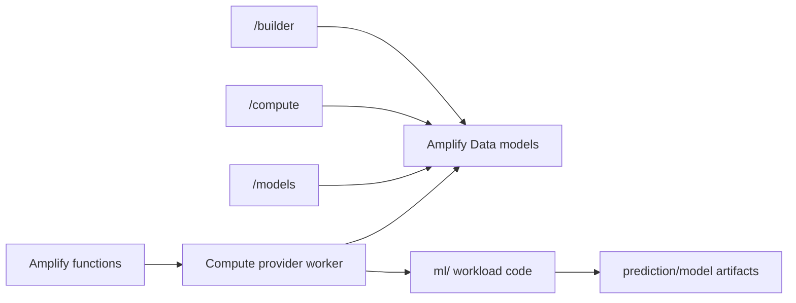

# Numerai ML Workload Code

This directory contains the Python training and inference workload for Numerai
models. It is no longer the dashboard orchestration layer.

The product control plane now lives in `frontend/` and `frontend/amplify/`:

- `/builder` persists `Pipeline`, `ModelBranch`, `SweepPlan`, `TrainingRun`, and
  `ComputeJob` records through Amplify Data.
- `/compute` is the place for provider/job operations.
- `/models` owns registry, lineage, and submission planning.
- New API/function work belongs under `frontend/amplify/functions/`.

Operator commands for the product surface live in `frontend/`:

```bash
cd frontend
npm test
npx tsc --noEmit --project tsconfig.json
npm run build
npm run sandbox
```

## What Stays Here

The `ml/` package remains useful for workload execution:

- downloading Numerai datasets with `numerapi`
- feature engineering and neutralization
- LightGBM/CatBoost training
- validation metrics
- inference and submission CSV generation
- SageMaker/container entry points used by provider workers

Keep new code in this directory focused on model execution. It should be callable
from an Amplify function, compute provider worker, local CLI, or container job.

Current integration status:

- Training and submission functions expose stable contracts in
  `frontend/amplify/functions/`.
- Provider launch, status polling, submission upload, and round scoring are still
  deterministic frontend-owned boundaries until real provider workers are wired.
- Workload code here should accept explicit artifact/input/output paths so
  provider workers can call it without dashboard-specific state.
- Numerai and compute secrets are not passed through GraphQL records; the
  frontend control plane stores only SSM SecureString references.

## Local Training

```bash
cd ml
pip install -r requirements.txt
python3 -m training.trainer --feature-set small --output ./output
```

Numerai credentials are only needed for upload/submission paths:

```bash
cp .env.example .env
# edit ML_NUMERAI_PUBLIC_ID and ML_NUMERAI_SECRET_KEY if uploading
```

### Provider configuration

Provider-backed scripts intentionally have no operator infrastructure defaults. Copy
`.env.example` and set the values for the account running the workload:

| Variable | Used by | Purpose |
| --- | --- | --- |
| `ML_S3_BUCKET` | Local, SageMaker, Modal | Artifact and progress bucket. |
| `AWS_REGION` | SageMaker and ECR | AWS region for provider resources. |
| `SAGEMAKER_ROLE_ARN` | SageMaker | Execution role assumed by training jobs. |
| `SAGEMAKER_TRAINING_IMAGE` | SageMaker | Full container image URI for training. |
| `AWS_PROFILE` | Optional CLI output | Local AWS CLI profile name. |
| `MODAL_APP_NAME` | Modal | Modal application name; defaults to `numerai-dashboard-ml`. |
| `ML_JOB_PREFIX` | Provider runners | Job-name prefix; defaults to `numerai-dashboard`. |
| `AWS_ACCOUNT_ID` | ECR build script | Target account for the image registry. |
| `ECR_REPOSITORY` | ECR build script | Repository name for the training image. |

The scripts fail with a configuration error before contacting a provider when a required
bucket, role, region, or image is missing.

## Current Boundary



The retired local service has been removed from this repository. Do not add new
REST callers for dashboard orchestration; use Amplify functions instead.

Rollback for workload changes is to redeploy the previous frontend/Amplify commit
or disable the affected provider in Settings. This directory should not become an
operator control plane again.

## Tests

```bash
cd ml
python3 -m pytest tests/ -v
```
